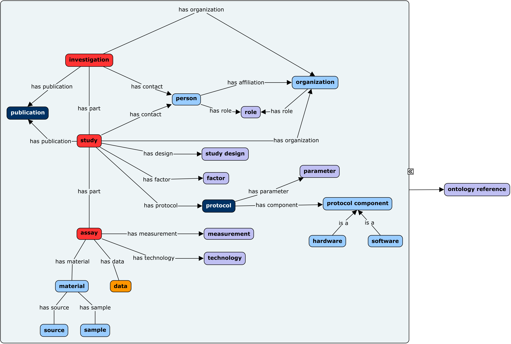
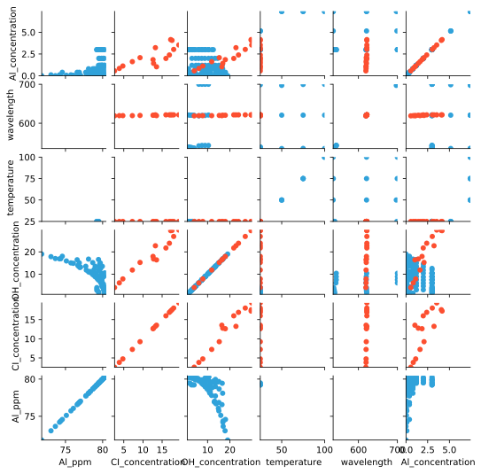

```{r, echo=FALSE}
library(knitr)
opts_chunk$set(eval=F)
```
## Overview

**Goal**: Visualize available literature data, as well as data created by the IDREAM group.

Based on feedback from IDREAM group members and others at PNNL:

  + Metadata handled with `ISA-tools`
  + Dataframe manipulation with `pandas`
  + Visualization handled with `bokeh`
  + (future) Database backend with `HDF5`


## ISA-Tools

> Built around the 'Investigation' (the project context), 'Study' (a unit of research) 
> and 'Assay' (analytical measurement) general-purpose Tabular format, the ISA tools 
> helps you to provide rich description of the experimental metadata (i.e. sample 
> characteristics, technology and measurement types, sample-to-data relationships) 
> so that the resulting data and discoveries are reproducible and reusable.


## ISA-Tools Continued




## ISA-Tools Initialization

ISA-Tools creates a `json` metadata entry from which the desired metadata attributes can be accessed.

```{json, EVAL=FALSE}
{
    "description": "Investigation into the properties of aluminate",
    "identifier": "Al_investigation",
    "studies": [
        {
            "assays": [
                {
                    "characteristicCategories": [],
                    "comments": [],
                    "dataFiles": [
                        {
                            "@id": "#data/plot-csv-extract-140429101060224",
                            "comments": [],
                            "name": "data/zhou_thesis.csv",
                            "type": "Plot-csv-extract"
                        }
                    ],
                    ...
```


## Extract the desired data & metadata from this json object

```{python, EVAL=FALSE}
def create_dataframes(json_metadata_path):
    """Construct dataframes with the needed metadata attached."""
    # Read the metadata json file constructed by ISASetup.py
    with open(json_metadata_path, 'r') as f:
        metadata = json.load(f)
    # create a dataframes for each csv found
    dataFrame_list = []
    for study in metadata['studies']:
        # Store the doi/link
        for publication in study['publications']:
            doi = publication['doi'] # This is buggy, just picks the last one. They should all be the same the way I implemented it.
        for assay in study['assays']:
            for filename in assay['dataFiles']:
                df = pd.read_csv(filename['name'])
                df['doi'] = doi
                dataFrame_list.append(df)
    return pd.concat(dataFrame_list)
```

## From ISA-Tools to Visualization with Bokeh

```{python, EVAL=FALSE}
import holoviews as hv
hv.extension('bokeh', width=95)
```




## Identifying Trends

  + Shoulder raman peaks emerge at ca. 3 Molar
  + Aluminum NMR values *converge* to ~80 ppm at higher concentrations
  + Trend in added base vs Al ppm
  + Lack of effects observed in temperature
  
  
## Status

  + **ISA-tools** Backend metadata managment tool in pace.
  + Method of extracting literature data in place **Webplotdigitizer**.
  + Can now:
    + add more data types
    + add IDREAM generated data
    + explore other visualization techniques
