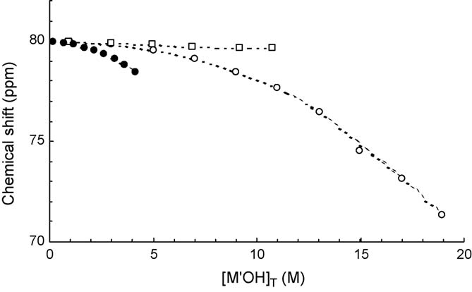
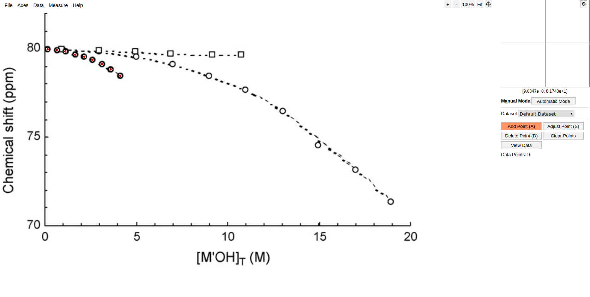
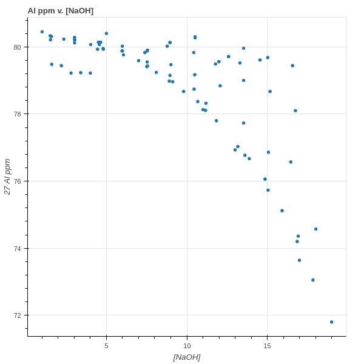

```{r, echo=FALSE}
library(knitr)
opts_chunk$set(eval=F)
```

## Overview

**Goal**: Visualize available literature data, as well as data created by the IDREAM group.

We want to explore generated and available data:

  + From many sources together
  + With all dimensions & conditions maintained.

This allows for:

  + Consistency checking
  + Exploration outside original experimental designs


## An example from the ground up

Suppose we would like to examine the effect concentration of aluminate effects 
is <sup>27</sup>Al NMR shift. We can take this plot below from a 2006 paper to start.



> <sup>27</sup>Al NMR chemical shift vs. the total molar concentration of KOH (☐),
> NaOH (○) and LiOH (●) at [Al(III)]T = 0.005 M.

## Using Web-Plot Digitizer

Tools exist for most of these types of problems, for this I have chosen **WebPlotDigitizer**.
This allows for the extraction of data.



http://arohatgi.info/WebPlotDigitizer/app/


## Combine Sources and Visualize

```
OH_concentration,Al_ppm
0.14, 79.96
0.66, 79.92
1.10, 79.84
1.64, 79.66
2.14, 79.54
2.59, 79.36
3.11, 79.13
3.59, 78.83
4.11, 78.47
```

That wasn't so hard -- repeat with a few more figures and examine the data...


## Visualization of ppm v [MOH]

<div class="columns-2">



  + The start of some trends are there, but --
  + We are missing some data from the original plots.

</div>


## Data

In the publication the following conditions where given:

  + Aluminate concentration = 0.005 M
  + The three counter ions, K+, Na+, Li+

<iframe src="plot2.html" frameBorder="0"></iframe>


## Explore other aspects

<div class="columns-2">


How can we visualize the aluminum concentration?

  + additional dimensions
  + size 

Datasets original annotation:

> 27Al NMR chemical shift vs. the total molar concentration of KOH (☐),
> NaOH (○) and LiOH (●) at [Al(III)]T = 0.005 M.

</div>


## Data growing pains

As the amount and types of data we desire to track grow, we will want to:

  + Keep track of where the data came from.
  + Get 'all the data we can' from our sources.
  + Do as little work as possible.


## Solution

It turns out much of these and similar problems can be solved the same way.

It also turns out that some of these problems have been solved to some degree.


## ISA-Tools Initialization

ISA-Tools creates a `json` metadata entry from which the desired metadata attributes can be accessed.

```{json, EVAL=FALSE}
{
    "description": "Investigation into the properties of aluminate",
    "identifier": "Al_investigation",
    "studies": [
        {
            "assays": [
                {
                    "characteristicCategories": [],
                    "comments": [],
                    "dataFiles": [
                        {
                            "@id": "#data/plot-csv-extract-140429101060224",
                            "comments": [],
                            "name": "data/zhou_thesis.csv",
                            "type": "Plot-csv-extract"
                        }
                    ],
                    ...
```

## Extract the desired data & metadata from this json object

```{python, EVAL=FALSE}
def create_dataframes(json_metadata_path):
    """Construct dataframes with the needed metadata attached."""
    with open(json_metadata_path, 'r') as f:
        metadata = json.load(f)
    dataFrame_list = []
    for study in metadata['studies']:
        for publication in study['publications']:
            doi = publication['doi']
        for assay in study['assays']:
            for filename in assay['dataFiles']:
                df = pd.read_csv(filename['name'])
                df['doi'] = doi
                dataFrame_list.append(df)
    return pd.concat(dataFrame_list)
```

## Wrangling Data

With our data set complete, we can return to analysis...

What about those aluminum concentrations?

<iframe src="plot3.html" frameBorder="0"></iframe>


##  Crossfilter Application Demo

demo application


## Thinking About Data

  Based on feedback from IDREAM group members and others at PNNL:

  + Metadata handled with `ISA-tools`
  + Dataframe manipulation with `pandas`
  + Visualization handled with `bokeh`
  + (future) Database backend with `HDF5`

## Status

  + **ISA-tools** Backend metadata managment tool in pace.
  + Method of extracting literature data in place **Webplotdigitizer**.
  + Can now:
    + add more data types & parsing functions
    + add IDREAM generated data

